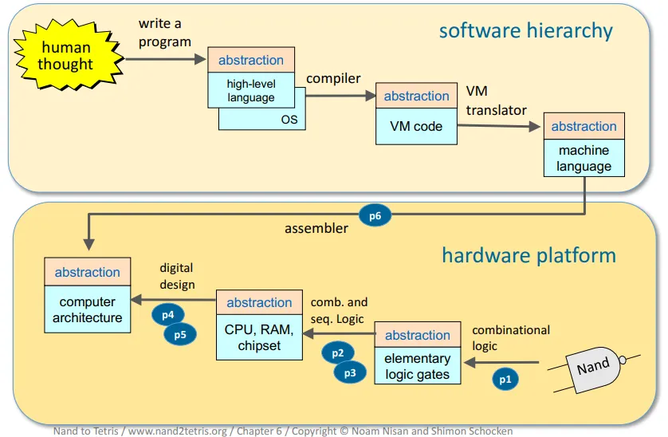

# Build a Modern Computer from First Principles: From Nand to Tetris

This repository contains all the completed projects from the excellent course "From Nand to Tetris" by Noam Nisan and Shimon Schocken.

## Overview

The intent of this course is to **build a fully functional computer** (to play Tetris on!).

My motivation for taking it was to **gain a deeper understanding of all the layers that constitute a modern computer**.

Before taking this course I developed programs running on a magic and mysterious box. Now it's still magic but not that mysterious anymore :slightly_smiling_face:

It was also a good opportunity to try coding in Python :snake:

## Links

- [The official website of Nand to Tetris courses](https://www.nand2tetris.org/)

- [Part 1 of the course on Coursera : Hardware platform](https://www.coursera.org/learn/build-a-computer)

> "In this project-centered course you will build a modern computer system, from the ground up. We’ll divide this fascinating journey into six hands-on projects that will take you from **constructing elementary logic gates** all the way through **creating a fully functioning general purpose computer**. In the process, you will learn - in the most direct and constructive way - how computers work, and how they are designed."

- [Part 2 of the course on Coursera : Software Hierarchy](https://www.coursera.org/learn/nand2tetris2)

> "In this project-centered course you will build a modern software hierarchy, designed to enable the translation and execution of object-based, high-level languages on a bare-bone computer hardware platform. In particular, you will **implement a virtual machine and a compiler** for a simple, Java-like programming language, and you will **develop a basic operating system** that closes gaps between the high-level language and the underlying hardware platform. In the process, you will gain a deep, hands-on understanding of numerous topics in applied computer science, e.g. stack processing, parsing, code generation, and classical algorithms and data structures for memory management, vector graphics, input-output handling, and various other topics that lie at the very core of every modern computer system."

